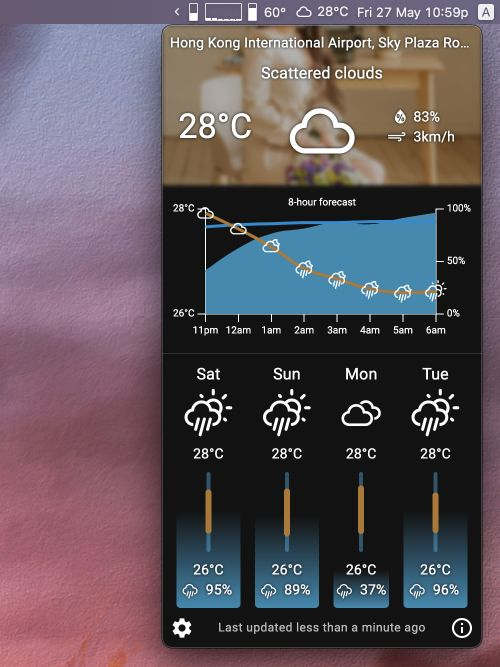
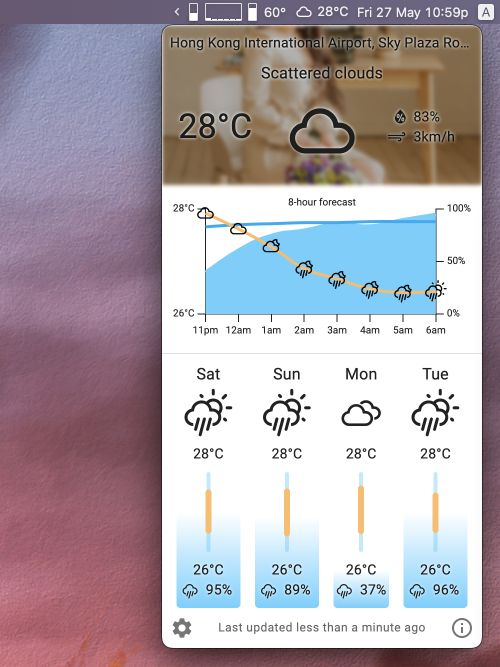

# Stormy

[](https://github.com/ayltai/stormy/actions)
[](https://sonarcloud.io/dashboard?id=ayltai_stormy)
[](https://sonarcloud.io/dashboard?id=ayltai_stormy)
[](https://sonarcloud.io/dashboard?id=ayltai_stormy)
[](https://sonarcloud.io/dashboard?id=ayltai_stormy)
[](https://sonarcloud.io/dashboard?id=ayltai_stormy)
[](https://sonarcloud.io/dashboard?id=ayltai_stormy)
[](https://sonarcloud.io/dashboard?id=ayltai_stormy)
[](https://sonarcloud.io/dashboard?id=ayltai_stormy)


[](https://github.com/ayltai/stormy/releases)
[](https://github.com/ayltai/stormy/blob/master/LICENSE)

A gorgeous weather forecast menubar app for macOS.

## Features
* Beautifully designed and easy to use weather app
* Current conditions, hourly and daily forecasts
* Supports multiple weather providers
* Provides only the information that matters to you
* Automatically refresh latest weather data
* Supports metric and imperial units
* Dark and light mode
* ... and more!

## Weather providers
* [AccuWeather](https://www.accuweather.com)
* [OpenWeatherMap](https://openweathermap.org)

## Screenshots





## Development
1. Install [NodeJS](https://nodejs.org)
2. Install dependencies
   ```shell
   npm i --legacy-peer-deps
   ```

### Configurations

#### AccuWeather API
1. Get an API key from [AccuWeather](https://developer.accuweather.com)
2. Specify the API key for using AccuWeather:
   ```shell
   export REACT_APP_API_KEY_ACCUWEATHER=XXXXX
   ```

#### OpenWeatherMap API
1. Get an API key from [OpenWeatherMap](https://openweathermap.org/api)
2. Specify the API key for using OpenWeatherMap:
   ```shell
   export REACT_APP_API_KEY_OPENWEATHERMAP=XXXXX
   ```

#### HERE API
1. Get an API key from [HERE](https://developer.here.com)
2. Specify the API key for using HERE:
   ```shell
   export REACT_APP_API_KEY_HERE=XXXXX
   ```

#### Unsplash API
1. Get an API key from [Unsplash](https://unsplash.com/developers)
2. Specify the API key for using Unsplash:
   ```shell
   export REACT_APP_API_KEY_UNSPLASH=XXXXX
   ```

### Run
1. Open a terminal window and run:
   ```shell
   npm start
   ```
2. Open a second terminal window and run:
   ```shell
   npm run electron
   ```

### Build
```shell
npm run build
```

### Package
```shell
npm run package
```

## License
This project is licensed under the terms of the [MIT license](https://github.com/ayltai/stormy/blob/LICENSE).
